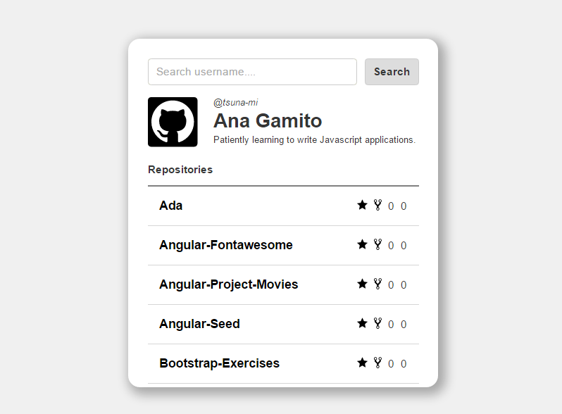

# JavaScript Test 
Project that create a client side web application using GitHub API for search an username and return his repos if the username exists. 
Webapp without libraries, just **Vanilla Javascript**, **Require.js** and **SASS**.

### To Run
- Run a static http-server in the folder application
- Visit **'http://your-localhost/dist/'**

---------

### Date of Project
September, 2016

### Place of birth
Barcelona, Spain

### Author
name | email 
--- | --- 
**Ana Gamito** | *ana_g_romero@hotmail.es*

---------